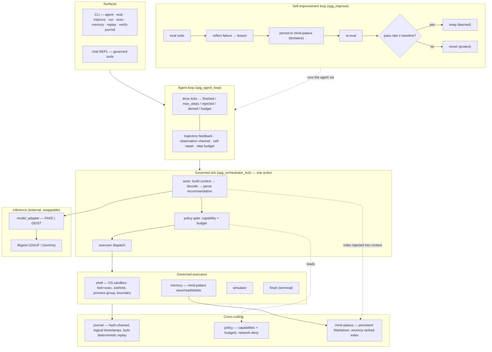

# sporegeist

A **governed agent runtime** written in pure C23. sporegeist is not another
"smart agent" wrapper — it is a deterministic, auditable *control plane* for
agent actions: every action a model proposes is policy‑gated, budget‑bounded,
journaled into a hash‑chained log, and replayable byte‑for‑byte. On top of that
spine sits a self‑improvement loop whose changes are accepted only if its own
evaluation harness proves they do not regress.

The language model is swappable and external (the [geist](https://github.com/geisten/geistlib)
engine, pinned). sporegeist owns everything *around* the model: perception,
governance, execution, audit, memory, evaluation, and learning.

```
make            # build (host-debug: ASan/UBSan, strict warnings)
make test       # framework-free C tests + CLI system tests
./build/host-debug/bin/sporegeist            # CLI: agent / eval / improve / run / exec / memory / replay / ...
./build/host-debug/bin/sporegeist-chat       # governed chat REPL
```

## Architecture



### The three loops

**1. The governed tick** (`spg_orchestrator_tick`) is the deterministic
single‑step primitive. The *actor* assembles a bounded context (graph state,
mind‑palace index, recent journal events, budgets, an action contract) and
decodes one model reply. That reply is parsed into a typed *recommendation*
(an s‑expression: `(recommend (kind …) (capability …) …)`). The *policy gate*
then decides ALLOW/DENY against capabilities and budgets — this stage is
mandatory and cannot be bypassed. An allowed action is dispatched to exactly one
executor (simulator, memory, local‑shell, or the `finish` control action), and
every step is written to the journal.

**2. The agent loop** (`spg_agent_loop`) drives ticks to termination. Each step's
result becomes an *observation* fed into the next step's context, and the full
journal trajectory is threaded back so the agent sees its own history (not just
the last result). It is goal‑driven (stops on a `finish` action), bounded by a
policy step budget, and self‑repairing: a malformed reply is fed back as a parse
error and retried instead of aborting.

**3. The self‑improvement loop** (`spg_improve`) turns evaluation failures into
durable lessons. It runs an eval suite, distills a lesson from each failing case
(keyed on the failure mode), persists it tentatively into the mind‑palace,
re‑evaluates, and **keeps the lesson only if the pass count did not drop** —
otherwise it reverts. The eval harness is the acceptance gate for the agent's
own self‑modifications.

### Evaluation (`sporegeist eval` / `improve`)

Suites are s‑expressions of scored cases. A scripted case drives a deterministic
fake model and is checked against expectations (termination reason, step bounds,
an observation substring), emitting a JSONL verdict per case — usable both in CI
and as the measurement step of the self‑improvement loop. A `(model "geist")`
case runs the real engine for production measurement.

```
$ sporegeist improve examples/eval/improve_gated.spg --memory-dir ./mem
{"lesson":"lesson-rejected","accepted":true,"baseline_passed":0,"trial_passed":1}
{"suite":"…","baseline_passed":0,"final_passed":1,"lessons_kept":1}
```

A recalled lesson flipped a failing case to passing (`0 → 1`) and was kept
because it helped; a harmful lesson would have been reverted.

## Where sporegeist is different — and where it is not

This section is deliberately critical. sporegeist makes a sharp bet: be a
*governance and self‑improvement substrate*, not a capable autonomous agent.

### Where we genuinely differentiate

| Axis | sporegeist | Typical agent frameworks (LangChain/LangGraph, AutoGPT, CrewAI) |
|---|---|---|
| **Governance** | A **mandatory** policy gate (capability + budget) on *every* action — constitutive, not optional middleware. | Guardrails are opt‑in middleware bolted around the loop. |
| **Determinism & audit** | Hash‑chained journal with logical timestamps → **byte‑identical replay**. | Non‑deterministic by default; tracing is best‑effort. |
| **Self‑improvement safety** | Learned changes are gated by the eval harness — **kept only if no regression**, else reverted. | "Self‑improving" demos rarely have an automatic regression gate; memory edits are unguarded. |
| **Sandboxed execution** | `local_shell` runs through fork+exec with `setrlimit`, process‑group kill, and an executor boundary — in a pure‑C runtime. | Usually shells out with no OS confinement. |
| **Footprint** | Pure C23, allocation‑free hot paths, caller‑provided buffers, no `malloc`/`assert`/GC; runs on constrained targets. | Python/Node runtimes; heavy dependencies. |

The combination — *mandatory gating + deterministic replay + eval‑gated
self‑improvement* in one allocation‑free C core — is, as far as we can tell, not
something mainstream frameworks offer. On the governance/auditability axis
sporegeist is arguably **ahead** of them.

### Where we are honestly behind

- **Reasoning capability.** sporegeist is *not* a smart agent. It runs a single
  small local model with no constrained/grammar‑guided decoding (the engine does
  not expose logit masking), so the model must emit a custom s‑expression
  grammar from free text — which small models do unreliably. Real‑model runs
  today frequently end in `rejected`. Frontier‑model agents with native
  function‑calling and explicit planning are far ahead here.
- **Memory.** The mind‑palace is recency/keyword‑ranked Markdown — no embeddings
  or semantic retrieval. Behind SOTA agent memory.
- **No planner / multi‑agent.** One action per tick; the loop is multi‑step but
  there is no task decomposition, reflection‑as‑reasoning, or sub‑agents.
- **Self‑improvement is mechanism‑proven, not capability‑proven.** The loop is
  real, safe, and deterministically shown to keep helpful lessons and revert
  harmful ones — but the *measurable gain* is demonstrated with a prompt‑gated
  test model. On the local Gemma the agent does not actually get smarter; the one
  remaining real‑world lever is a stronger / function‑calling model, which the
  swappable adapter already supports.
- **Ecosystem.** No MCP bridge, a small tool set, no streaming; v0.1.0.

### Honest positioning

sporegeist is **SOTA‑grade on governance, determinism, auditability, and
self‑improvement *safety*** — and deliberately minimal (and behind) on raw agent
*capability*. It is the chassis and the safety system, not yet the engine. The
architecture is built so a stronger model drops in without touching the spine.

## Layout

| Path | Role |
|---|---|
| `src/run/` | orchestrator tick, agent loop, agent runner |
| `src/actor/`, `src/context/` | perception: context assembly + recommendation parsing |
| `src/policy/`, `src/executor/` | policy gate + execution boundary |
| `src/exec/` | sandboxed command executor, shell executor, host probe |
| `src/memory/` | mind‑palace store + memory executor |
| `src/sim/` | security simulator + risk model |
| `src/eval/`, `src/improve/` | evaluation harness + self‑improvement loop |
| `src/journal/`, `src/core/`, `src/dsl/` | hash‑chained journal, primitives, s‑expression DSL |
| `src/cli/`, `src/chat/` | CLI and chat REPL surfaces |
| `deps/geist/` | the external inference engine (pinned `v0.2.1`) |

## Constraints

See [.agent/AGENT.md](.agent/AGENT.md). In short: C23, no `malloc`/`assert`,
count‑precedes‑array buffer contracts, allocation‑free hot paths, deterministic
behaviour, clean under `-Wall -Wextra -Wpedantic -Wconversion -Wshadow` plus
ASan/UBSan.
